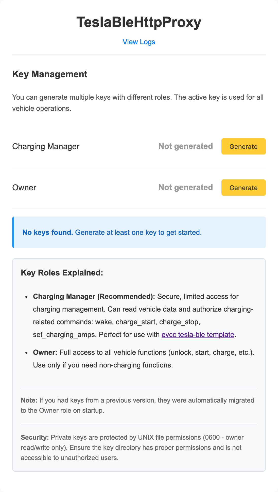
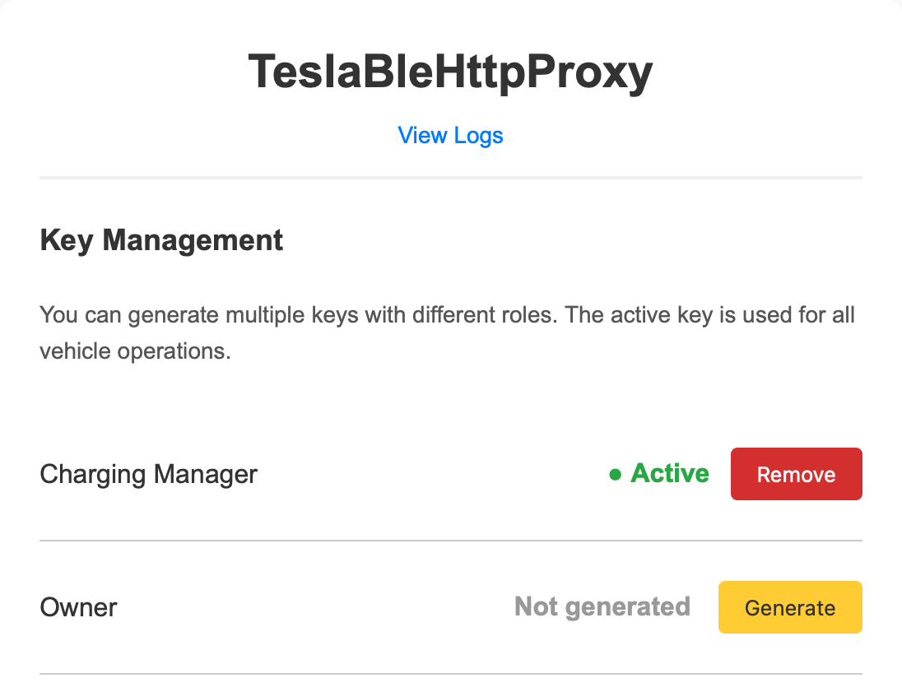
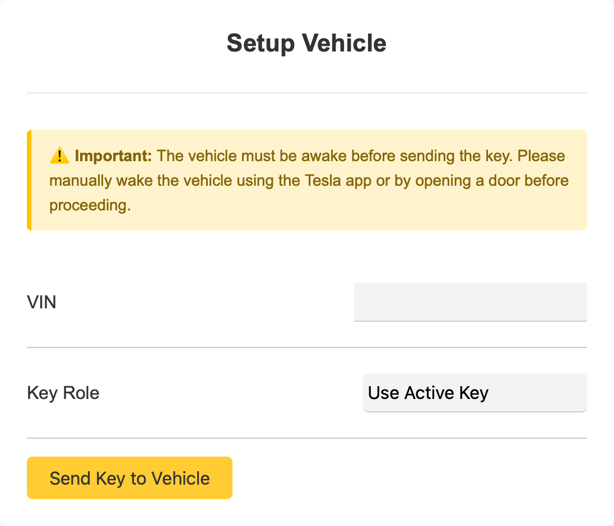

# Installation

## Step 1: Install Raspberian

Setup your raspberry Pi. You will find an installer here: https://www.raspberrypi.com/software/

Login to your Pi with a terminal. 

```
ssh user@IP
```

Update everything once after installation:

```
sudo apt-get update && sudo apt-get upgrade
```

## Step 2: Install TeslaBleHttpProxy

There are two alternative ways to install TeslaBleHttpProxy. You can either run the program in Docker or compile it with Go and run it directly.

- [Install with Docker](#step-a-1-install-docker) or
- [Compile and run directly](#step-b-1-download-and-build)

*(You must either follow steps A-x or steps B-x. You do not have to do both!)*

### Step A-1: Install Docker

Go back to your home directory:

```
cd ~
```

Install Docker:

```
curl -sSL https://get.docker.com | sh
```

Setup the Docker user:

```
sudo usermod -aG docker $USER
```

Now you have to log out and log back in for it to take effect.

### Step A-2: Setup docker compose

Make sure you are in the home directory `~` again. Create a Folder for your Docker-Files for example `TeslaBleHttpProxy` and enter the new folder:

```
mkdir TeslaBleHttpProxy
cd TeslaBleHttpProxy
mkdir key
```

Create the docker compose file and open it:

```
nano docker-compose.yml
```

Paste the following content to the file:

```
services:
  tesla-ble-http-proxy:
    image: wimaha/tesla-ble-http-proxy
    container_name: tesla-ble-http-proxy
    volumes:
      - ~/TeslaBleHttpProxy/key:/key
      - /var/run/dbus:/var/run/dbus
    restart: always
    privileged: true
    network_mode: host
    cap_add:
      - NET_ADMIN
      - SYS_ADMIN
```

Exit the file with control + x and type `y` to save the file.

### Step A-3: Start the container

Start the container with the following command:

```
docker compose up -d
```

### Step A-4: Update and Show logs

You can update the container as follows:

```
docker pull wimaha/tesla-ble-http-proxy
docker compose up -d
```

You can show the logs like:

```
docker logs --since 12h tesla-ble-http-proxy
```

### Step B-1: Download and Build

This variant will be described later.

## Step 3: Generate key for vehicle

To generate the required keys browse to `http://YOUR_IP:8080/dashboard`. In the dashboard you will see that the keys are missing:



Please click on `generate Keys` and the keys will be automatically generated and saved.



After that please enter your VIN under `Setup Vehicle`. Before you proceed make sure your vehicle is awake! So you have to manually wake the vehicle before you send the key to the vehicle.



Finally the keys is send to the vehicle. You have to confirm by tapping your NFC card on center console.


You can now close the dashboard and use the proxy. 🙂
